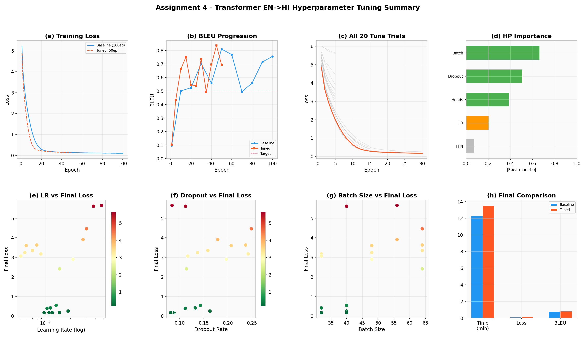

# Assignment 4  -  Optimizing Transformer Translation with Ray Tune & Optuna

<div align="center">


**Roll No:** M25CSA023 &nbsp;|&nbsp; **Course:** DLOps &nbsp;|&nbsp; **Semester:** 2 &nbsp;|&nbsp; **Institute:** IIT Jodhpur

</div>

---

## Overview

This assignment implements a **from-scratch PyTorch encoder-decoder Transformer** for
**English → Hindi machine translation**, then uses **Ray Tune + Optuna** to automatically
find a better hyperparameter configuration that matches or exceeds the baseline BLEU score
in significantly fewer epochs.

> **Architecture:** Vaswani et al. (2017)  -  [*Attention Is All You Need*](https://papers.neurips.cc/paper/7181-attention-is-all-you-need.pdf) &nbsp;|&nbsp; [Papers with Code](https://paperswithcode.com/paper/attention-is-all-you-need)

---

## Results Summary



> **(a)** Training loss  -  baseline vs tuned &nbsp;·&nbsp;
> **(b)** BLEU progression &nbsp;·&nbsp;
> **(c)** All 20 Ray Tune trials &nbsp;·&nbsp;
> **(d)** Hyperparameter importance &nbsp;·&nbsp;
> **(e–g)** HP scatter plots &nbsp;·&nbsp;
> **(h)** Final comparison

---

## Key Results

| Metric | v1.0.0 Baseline | v1.1.0 Optimised | Δ |
|---|---|---|---|
| **BLEU Score** | 0.7566 | **0.8369** | **+10.6%** |
| Final Loss | 0.0998 | 0.1264 |  -  |
| Epochs | 100 | **50** | −50% |
| Training Time | 12.27 min | 13.53 min |  -  |
| Epochs to match baseline BLEU | 100 | **~10** | **−90%** |

---

## Repository Structure

```
Assignment-4/
├── m25csa023_ass_4_tuned_en_to_hi.py     ← main training + Ray Tune script
├── download_model.py                      ← auto-download weights from HF
├── setup.py                               ← pip install with auto-download
│
├── transformer_translation_final/         ← v1.0.0 baseline model
│   └── README.md                          ← HF download link + model specs
│
├── m25csa023_ass_4_best_model/               ← v1.1.0 optimised model 
│   └── README.md                          ← HF download link + model specs
│
├── report/
│   └── m25csa023_ass_4_report.pdf         ← assignment report
│
└── results/
    ├── baseline_metrics.json
    ├── best_config.json
    ├── tuned_metrics.json
    ├── trial_data.json
    └── plots/
        ├── 0_summary_figure.png
        ├── 1_baseline_loss_curve.png
        ├── 2_tuned_loss_curve.png
        ├── 3_baseline_vs_tuned_loss.png
        ├── 4_bleu_comparison.png
        ├── 5_ray_tune_all_trials.png
        ├── 6a_hyperparameter_scatter.png
        ├── 6b_hyperparameter_importance.png
        └── 7_final_comparison_bars.png
```

---

## Model Weights on Hugging Face

Model weights are hosted on 🤗 Hugging Face (too large for Git):

| Version | File | BLEU | Link |
|---|---|---|---|
| **v1.0.0** Baseline | `transformer_translation_final.pth` | 0.7566 | [Download](https://huggingface.co/priyadip/en-hi-transformer/resolve/main/v1.0.0/transformer_translation_final.pth) |
| **v1.1.0** Optimised ✓ | `m25csa023_ass_4_best_model.pth` | **0.8369** | [Download](https://huggingface.co/priyadip/en-hi-transformer/resolve/main/v1.1.0/m25csa023_ass_4_best_model.pth) |

**Full model card:** [huggingface.co/priyadip/en-hi-transformer](https://huggingface.co/priyadip/en-hi-transformer)

---

## Quick Start

### Option A — pip install

```bash
# Step 1: install package + dependencies
pip install git+https://github.com/priyadip/MLOps-Priyadip_Sau-M25CSA023.git@Assignment-4

# Step 2: download model weights into your current folder
download-en-hi-models

# Skip download (CI / custom builds)
SKIP_MODEL_DOWNLOAD=1 python download_model.py
```

### Option B — clone manually

```bash
git clone -b Assignment-4 https://github.com/priyadip/MLOps-Priyadip_Sau-M25CSA023.git
cd MLOps-Priyadip_Sau-M25CSA023
pip install huggingface_hub torch nltk ray[tune] optuna
python download_model.py
```

### Download models only

```bash
python download_model.py

# Output:
============================================================
  Downloading EN→HI Transformer models from Hugging Face
  Repo : https://huggingface.co/priyadip/en-hi-transformer
============================================================

── v1.0.0  (baseline, BLEU 0.7566, 100 epochs)
  [DOWN]  v1.0.0/transformer_translation_final.pth  →  ./transformer_translation_final/...
  [ OK ]  transformer_translation_final.pth  (192 MB)

── v1.1.0  (optimised, BLEU 0.8369, 50 epochs)  ← recommended
  [DOWN]  v1.1.0/m25csa023_ass_4_best_model.pth  →  ./m25csa023_ass_4_best_model/...
  [ OK ]  m25csa023_ass_4_best_model.pth  (216 MB)
```

---

## Model Architecture

Built from scratch  -  no HuggingFace Transformers library used internally.

| Component | Value |
|---|---|
| Architecture | Encoder-Decoder Transformer |
| d_model | 512 |
| num_layers | 6 encoder + 6 decoder |
| num_heads | 8 |
| Max sequence length | 50 tokens |
| Source vocabulary | 4 117 English tokens |
| Target vocabulary | 4 044 Hindi tokens |
| Positional encoding | Sinusoidal (fixed) |
| Loss | CrossEntropyLoss (ignore padding) |
| Optimiser | Adam |

---

## Part 1  -  Baseline (v1.0.0)

Trained for **100 epochs** with fixed hyperparameters on NVIDIA A100 80 GB,
with three PyTorch performance optimisations:

```python
with torch.autocast(device_type="cuda", dtype=torch.bfloat16):
    ...
torch.compile(model)
torch.backends.cudnn.benchmark = True
```

| Hyperparameter | Value |
|---|---|
| Learning rate | 1e-4 |
| Batch size | 60 |
| d_ff | 2048 |
| Dropout | 0.10 |

**Results:** BLEU `0.7566` · Loss `0.0998` · Time `12.27 min`

---

## Part 2  -  Ray Tune + Optuna (v1.1.0)

Refactored training into `train_tune(config)` and ran **20 trials** using:
- **OptunaSearch** (TPE Bayesian sampler)
- **ASHAScheduler** (grace_period=5, reduction_factor=3)  -  pruned ~65% of trials early

### Search Space

| Hyperparameter | API | Range |
|---|---|---|
| Learning rate | `tune.loguniform` | 5e-5 to 5e-4 |
| Batch size | `tune.qrandint` | 32–40, step 2 |
| num_heads | `tune.choice` | 4, 8, 16 |
| d_ff | `tune.qrandint` | 1536–3072, step 512 |
| Dropout | `tune.uniform` | 0.05–0.25 |

### Best Configuration

```python
best_config = {
    "lr":         1.1117e-4,
    "batch_size": 32,
    "num_heads":  8,
    "d_ff":       2560,
    "dropout":    0.081,
}
```

**Results:** BLEU `0.8369` · Loss `0.1264` · Epochs `50` · Time `13.53 min`

---

## Dataset

**Raw [Tatoeba](https://tatoeba.org/en/downloads) EN-HI export**  -  13 186 sentence pairs.

| Column | Content |
|---|---|
| 1 | English sentence ID |
| 2 | English sentence |
| 3 | Hindi sentence ID |
| 4 | Hindi sentence |

---

## References

- Vaswani et al. (2017)  -  [Attention Is All You Need](https://papers.neurips.cc/paper/7181-attention-is-all-you-need.pdf) · [Papers with Code](https://paperswithcode.com/paper/attention-is-all-you-need)
- [Ray Tune Documentation](https://docs.ray.io/en/latest/tune/index.html)
- [Optuna Documentation](https://optuna.readthedocs.io)
- [Tatoeba Dataset](https://tatoeba.org/en/downloads)
- [Hugging Face Model](https://huggingface.co/priyadip/en-hi-transformer)

---

<div align="center">
<sub>M25CSA023 · DLOps · M.Tech CSA Semester 2 · IIT Jodhpur · 2026</sub>
</div>
